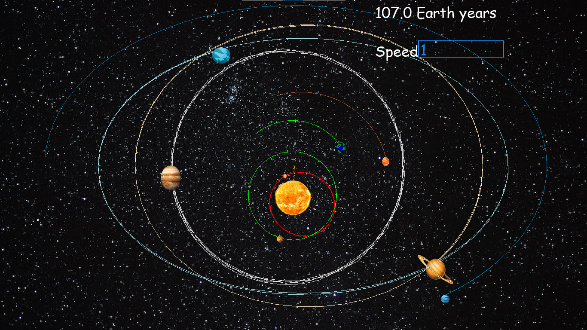

# Solar System Simulation

## Overview

The Solar System Simulation project is an interactive program that simulates the orbits of planets and celestial bodies within our Solar System. It provides a visual representation of planetary motion and gravitational forces, making it an educational and captivating tool for space enthusiasts and learners.

## Why I built it
I started to build this after I learned about gravitational motion in my junior year, and I wanted to check if we calculate the forces between each planet and other masses in that system result in an acceleration and hence change in velocity to create an elliptical path and my program verified that it it is true.

## Scaling
Using the same scale for all planets caused an issue: the screen only displayed the inner planets.

Increasing the scale reduction by a factor of 10 brought the outer planets into view, but the inner planets ended up overlapping and some seemed to be drawn towards the sun.

I tried adding a ZOOMING feature to it, but it failed to show the overall picture of planetary motions. So I used different scales for each planet.

## note
The slight overlap of Venus and Mercury is due to their actual paths in 3D space, while Jupiter and Uranus appear to intersect because of the different scales used for each planet.

## Documentation

The Solar System Simulation project is implemented in Fortran and Python. The Fortran code handles the backend calculations, while the Python code, along with Pygame, creates the interactive front end.

The simulation uses Newton's law of universal gravitation to calculate the gravitational forces between celestial bodies, resulting in realistic planetary orbits.

## License

This project is open-source and available under the [MIT License](LICENSE.md). You are free to use, modify, and distribute this code as long as you adhere to the terms of the license.

## Acknowledgments

This project was made possible with the contributions of open-source libraries and resources from the scientific and programming communities. I would like to acknowledge the [Pygame] (https://www.pygame.org/) community for their invaluable contributions to this project. Pygame library provided the foundation for creating the interactive front end of the Solar System simulation.

- Pygame: [https://www.pygame.org/](https://www.pygame.org/)

## Contact
For questions, suggestions, or contributions, please feel free to contact the project maintainer:

- Mikiyas Meles Assefa
- Email: massefa@andrew.cmu.edu
- GitHub: [https://github.com/Mikiyas-Meles-Assefa)

## Contributing

If you would like to contribute to this project, I welcome contributions from the community. 

## Updates and Maintenance

This project is actively maintained, and updates are planned to enhance its features and usability. Community contributions and feedback are highly appreciated in the ongoing development of the Solar System Simulation.
